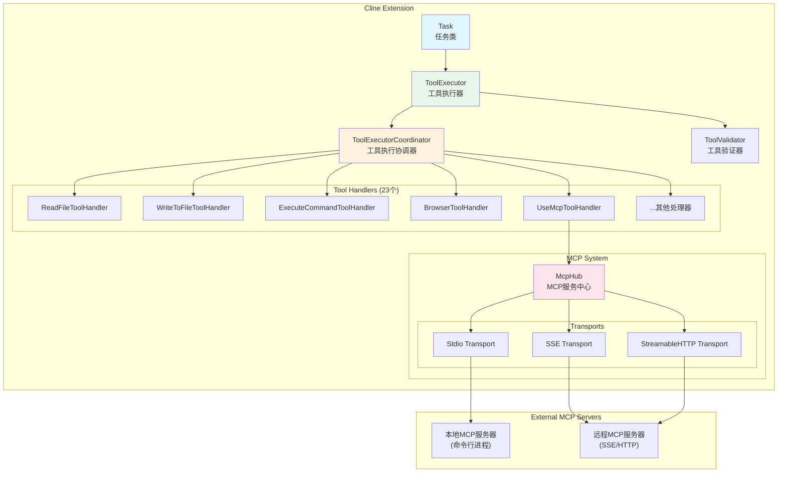
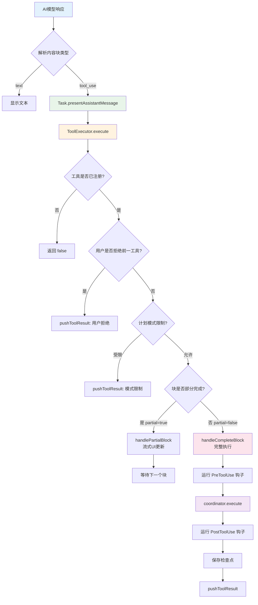
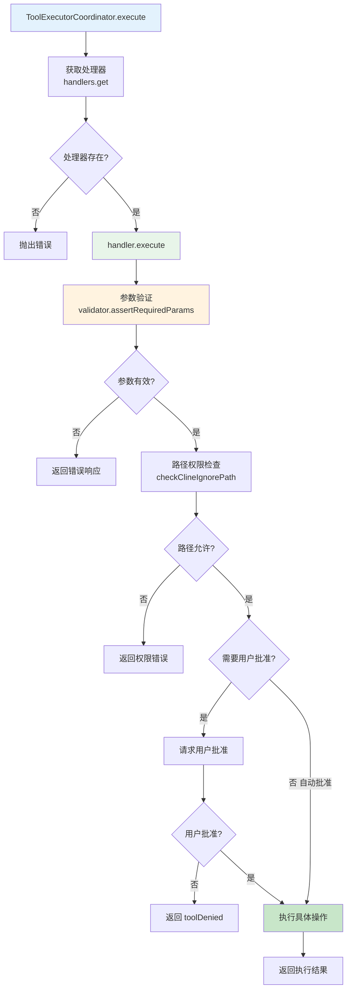
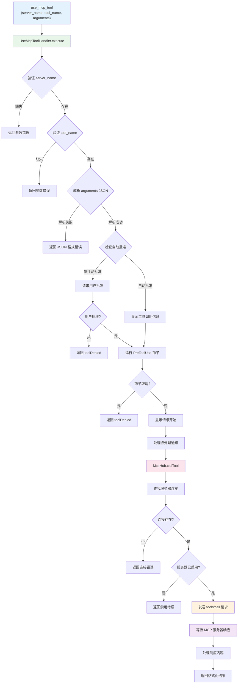
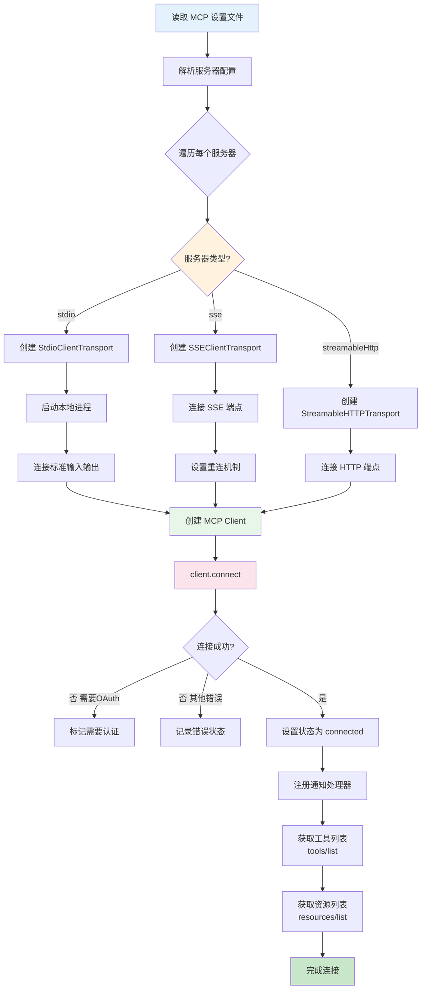
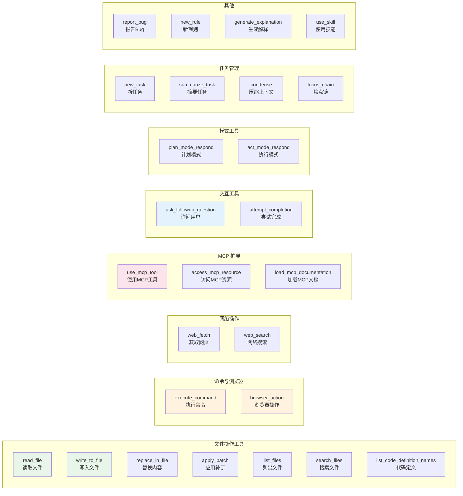
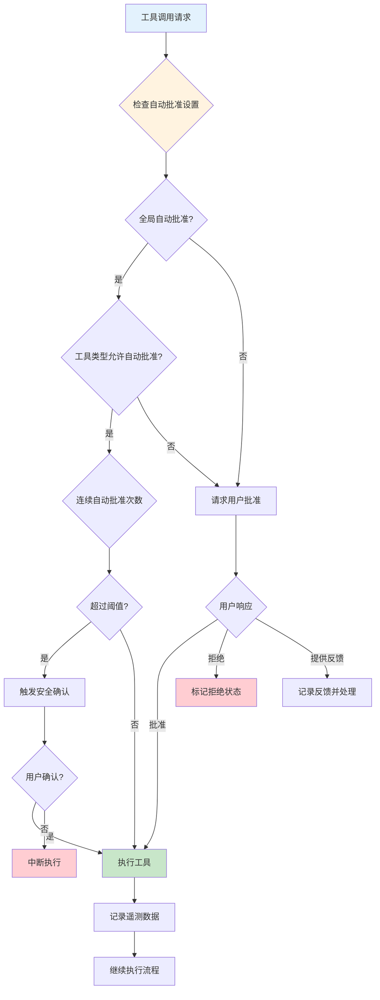
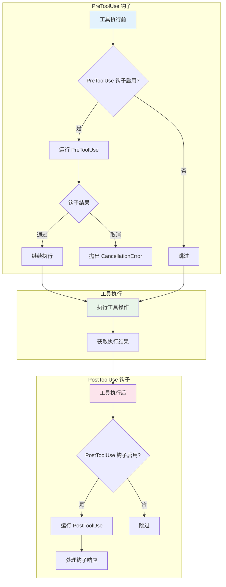

# Cline 工具调用流程图

本文档包含 Cline 工具系统的详细流程图，使用 Mermaid 格式。

## 1. 工具系统整体架构图

## 2. 工具调用主流程

## 3. 工具处理器执行流程

## 4. MCP 工具调用流程

## 5. MCP 服务器连接流程

## 6. 工具类型分类图

## 7. 工具批准流程

## 8. 钩子机制流程

---

## 使用说明

这些流程图使用 [Mermaid](https://mermaid.js.org/) 语法编写，可以在以下环境中渲染：

1. **GitHub** - 直接在 GitHub 上查看 Markdown 文件
2. **VS Code** - 安装 Mermaid 预览插件
3. **Mermaid Live Editor** - https://mermaid.live/
4. **GitLab** - 原生支持 Mermaid
5. **Notion** - 支持 Mermaid 代码块

## 图例说明

| 颜色 | 含义 |
|------|------|
| 蓝色 (#e3f2fd) | 入口点/起始 |
| 绿色 (#e8f5e9) | 主要处理逻辑 |
| 橙色 (#fff3e0) | 决策/分支 |
| 粉色 (#fce4ec) | MCP 相关 |
| 红色 (#ffcdd2) | 错误/终止 |
| 浅绿 (#c8e6c9) | 成功完成 |